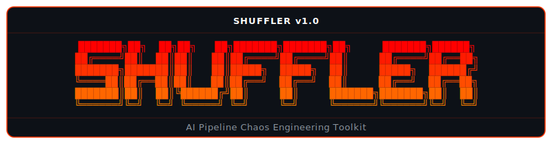

<p align="center">
  
</p>

**AI Pipeline Chaos Engineering Toolkit** — expose race conditions and LLM hallucinations in AI orchestration pipelines before they corrupt production data.

## Overview

Shuffler is a CLI-driven chaos engineering toolkit that stress-tests AI agent pipelines by simulating two real-world failure modes:

1. **Duplication (Race Conditions)** — Fires concurrent identical payloads at a target endpoint to reveal missing idempotency guards, causing duplicate records in downstream CRMs.
2. **Hallucination (Schema Entropy)** — Triggers LLM response corruption by injecting chaos headers that cause the AI agent to wrap JSON output in markdown backticks, breaking downstream parsers.

The toolkit includes a full local sandbox with a mock CRM receiver, a chaos-enabled AI agent, and a PostgreSQL-backed idempotency ledger to demonstrate both the **vulnerable** and **secured** architectures.

## Architecture

```
┌──────────────┐         ┌──────────────────┐         ┌────────────────┐
│  shuffler    │  HTTP   │  Sevlar Gateway   │  HTTP   │  Mock CRM      │
│  CLI         │ ──────► │  (chaos_agent)    │ ──────► │  Receiver      │
│              │         │  :8000            │         │  :8001         │
└──────────────┘         └────────┬─────────┘         └────────────────┘
                                  │
                         ┌────────▼─────────┐
                         │  PostgreSQL       │
                         │  (idempotency     │
                         │   ledger)  :5432  │
                         └──────────────────┘
```

## Prerequisites

- Python 3.11+
- Docker and Docker Compose (for the full sandbox)
- A `GEMINI_API_KEY` environment variable (for the live chaos agent)

## Installation

### Option A: Global Installation (Recommended for End Users / SREs)

Modern Linux and macOS distributions enforce **PEP 668** (externally-managed
environments), which prevents `pip install` from writing into the system Python.
The correct way to install a Python CLI tool globally is with
[**pipx**](https://pipx.pypa.io/), which gives the application its own isolated
virtualenv while still exposing the binary on your `$PATH`.

```bash
# Install pipx if not present (Debian/Ubuntu example)
sudo apt install pipx
pipx ensurepath

# Install Shuffler globally in editable development mode
pipx install --editable . --force
```

After installation, the **`shuffler`** command is available system-wide.
No virtual environment activation is required -- invoke it from any directory.

### Option B: Isolated Virtual Environment (Recommended for Contributors)

If you are developing or contributing to Shuffler, use a standard virtual
environment so that test dependencies are also available:

```bash
python3 -m venv .venv
source .venv/bin/activate
pip install -e ".[dev]"
```

## Sandbox Deployment

```bash
docker compose up --build
```

This starts three services:

| Service | Port | Description |
|---|---|---|
| `sevlar-gateway` | `8000` | AI agent ingress (target endpoint) |
| `mock-crm` | `8001` | Simulated CRM lead receiver |
| `datastore` | `5432` | PostgreSQL with idempotency ledger |

## Quick Start

Verify that the installation completed successfully:

```bash
shuffler --version
shuffler --help
```

## Usage

### Launching an Attack

```bash
# Duplication attack -- 50 concurrent identical payloads
shuffler attack --target http://localhost:8000 --vector duplication --burst 50

# Hallucination attack -- default burst size
shuffler attack --target http://localhost:8000 --vector hallucination
```

### Database-Level Simulation

`test_runner.py` demonstrates the race condition at the database level -- first
without protection, then with the idempotency ledger applied:

```bash
# Requires DB_DSN and CRM_WEBHOOK_URI environment variables
python test_runner.py
```

## CLI Reference

```
Usage: shuffler attack [OPTIONS]

Options:
  -t, --target TEXT     URL of the target ingress point  [default: http://localhost:8000]
  -v, --vector TEXT     Attack vector: duplication | hallucination  [required]
  -b, --burst  INTEGER  Number of concurrent payloads to fire  [default: 15]
```

## Attack Vectors

### `duplication`

Fires N concurrent HTTP POST requests with identical payloads to expose missing idempotency guards. If the target has no deduplication logic, every request creates a new record, corrupting the CRM with duplicates.

### `hallucination`

Sends payloads with an `X-Chaos-Mode: hallucination` header. The chaos agent alternates between returning clean JSON and wrapping responses in markdown ` ```json ``` ` backticks. Downstream JSON parsers that do not strip markdown formatting will fail.

## Testing

Run the automated test suite:

```bash
python -m pytest -v
```

The suite validates:

- **Model invariants** — `AttackReport` and `PayloadResult` aggregation logic (`success_count`, `failure_count`, `corrupted_count`).
- **Corruption detection** — Backtick regex coverage and endpoint-level integration tests against the mock CRM receiver.

## Project Structure

```
shuffler/                       # Repository root
├── pyproject.toml              # Package metadata, dependencies, entry point
├── chaos_agent.py              # FastAPI chaos-enabled AI agent (Gemini LLM)
├── mock_receiver.py            # FastAPI mock CRM receiver
├── test_runner.py              # Database-level race condition simulation
├── docker-compose.yml          # Full sandbox orchestration
├── Dockerfile.mock             # Container for the mock CRM receiver
├── tests/
│   ├── test_models.py          # AttackReport / PayloadResult invariant tests
│   └── test_corruption.py      # Corruption detection validation tests
└── shuffler/                   # Installable Python package
    ├── __init__.py              # Package init, exports __version__
    ├── main.py                  # CLI entry point (Typer app, cli() wrapper)
    ├── display.py               # Rich terminal output (banner, tables, verdicts)
    ├── models.py                # Dataclass models (AttackReport, PayloadResult)
    └── vectors/
        ├── concurrency.py       # Duplication attack vector implementation
        └── hallucination.py     # Hallucination attack vector implementation
```

## License

This project is licensed under the **MIT License**. See [LICENSE](./LICENSE)
for the full text.

## Security

To report a vulnerability, see [SECURITY.md](./SECURITY.md).
